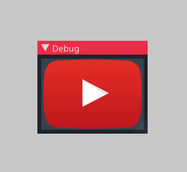

ofxImgui
========


Example
-------

In `ofApp.h`:

```cpp
#pragma once

#include "ofMain.h"

#include "ofxImgui.h"

class ofApp : public ofBaseApp
{
  public:
  
  ...
  
  ofxImgui m_ui;
}
```

In `ofApp.cpp`:

```cpp
void ofApp::draw()
{
  m_ui.begin();

    static bool show_another_window = true;
    static bool show_test_window = true;

    if(show_another_window)
    {
      ui::SetNextWindowSize(ImVec2(200, 100), ImGuiSetCond_FirstUseEver);
      ui::Begin("Another Window", &show_another_window);
      ui::Text("Hello");
      ui::End();
    }

    if(show_test_window)
    {
      ui::SetNextWindowPos(ImVec2(650, 20), ImGuiSetCond_FirstUseEver);
      ui::ShowTestWindow(&show_test_window);
    }

  m_ui.end();
}
```

Loading Images and Image Buttons
--------------------------------



```cpp
GLuint tex_button;

void ofApp::setup()
{
  ofImage img_button;
  img_button.load("youtube.png");
  tex_button = m_ui.loadTextureImage2D(img_button);
}

void ofApp::draw()
{
  m_ui.begin();
  
    bool pressed = ui::ImageButton((ImTextureID)(uintptr_t)tex_button, ImVec2(200, 141));
  
  m_ui.end();
}
```
